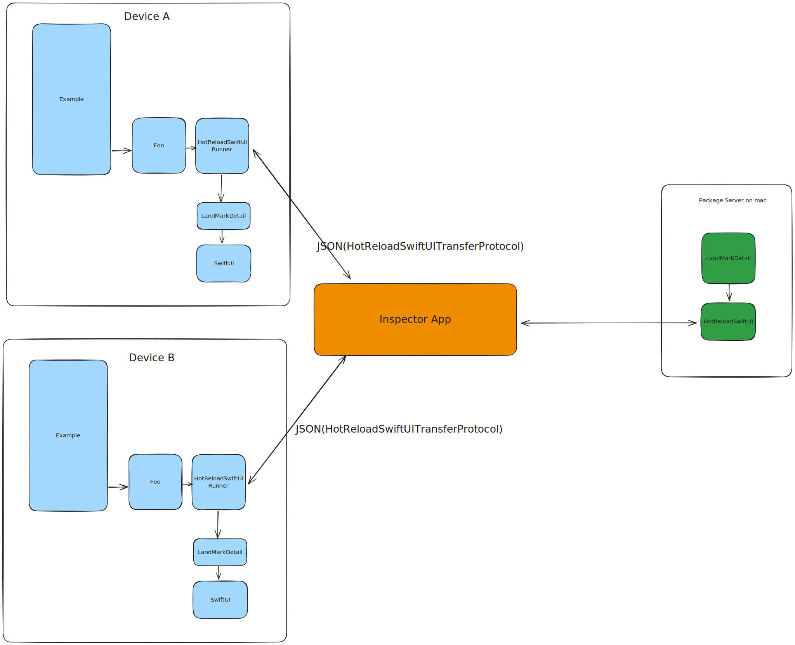

# HotReloadSwiftUI

这是一个实验性项目，意在做出一个让 SwiftUI 的 HotReload 功能更为可用的产品原型。

## 先看效果

TBD

## 为什么会有这个项目？

当我们使用 SwiftUI 的 HotReload 功能的时候，我们会遇到以下这些问题：

1. 无法使用断点调试（作为对比，Flutter、ReactNative 的 HotReload 功能都可以正常使用断点）
2. 无法在多个设备上同时预览效果（曾经 Xcode Preview 也有这样的功能，[但很遗憾后来被移除了](https://www.producthunt.com/)）
3. 在大型工程中基本无法使用

在这个方面，[Inject](https://github.com/krzysztofzablocki/Inject) 也做出了非常不错的尝试，不过由于 Inject 本身的设计（监控），其还是会有一些这样的限制：

1. 无法使用断点调试
2. 每个 SwiftUI 视图都要手动注入一个 `@ObserveInjection var inject`，具有侵入性
3. 存在 [诸多限制](https://github.com/johnno1962/InjectionIII?tab=readme-ov-file#what-injection-cant-do)，实践中，在 SwiftUI 中额外增加一个 `@State` 就会崩溃，使用过程中很难知道边界在哪里

当然，Inject 本身是为了能够将所有的代码 HotReload 执行而创建出来的，因此其技术路径基于 LLVM 来演进也是毫无问题的一个选择。

如果我们只将目光聚焦在 SwiftUI 上呢？是不是可以用一些特别的办法来让 SwiftUI 中的 HotReload 更加好用？

答案是肯定的：**借鉴 ReactNative 的做法**

## 快速开始

只需要如下几步，就可以体验到 HotReloadSwiftUI 的丝滑体验：

1. 打开 Example 项目，将项目运行到一个设备上
2. 运行 Foo 项目
3. 查看 Example 项目已经被更新

## 基本原理

在当前项目中，我们存在这么几个项目：

- Example：作为宿主的 Example 项目
- HotReloadSwiftUI：作为中间层的 SwiftUI 项目
- HotReloadRunner：作为中间层的 Runner 项目
- HotReloadMacro：作为中间层的 Macro 项目
- HotReloadSwiftUITransferProtocol： 作为中间层的 TransferProtocol 项目，定义了所有传输的协议

这几个项目之间的关系如下图所示：

## 当前状态

TBD
