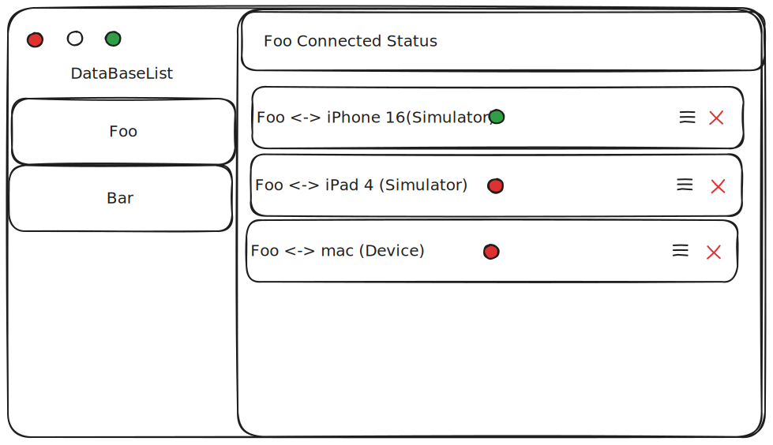
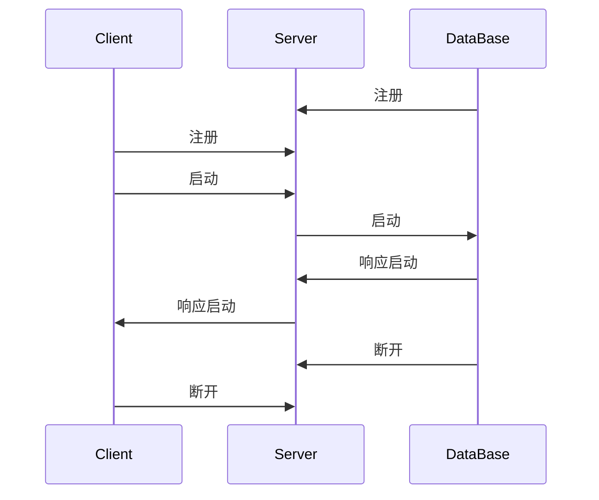

# 整体设计

在整个项目中，运行在 macOS 上的代码，我们称之为 DataBase，而运行在真机/模拟器上的代码，我们称之为 Client。

Inspector App 则作为 Server，负责管理 Data 与 Client 之间的连接。

## Server 功能设计

Inspector App 启动后，需要在本地启动一个 HTTP 服务器，主要功能包括：

1. 分发服务器
   - 监听固定端口（默认 44023）
   - 当接收到来自服务端（本地代码）请求时，对其 package + id 进行记录
   - 当接收到来自客户端（运行应用）请求时，根据 package + id 进行分配，并与对应的服务端建立 websocket 连接
2. 连接状态展示
   - 显示所有已连接的本地代码和运行应用列表
3. 调试日志
   - 记录视图更新日志
   - 记录 SwiftUI 数据更新日志

这个 Inspector App 的基本界面，如下图所示：

## Client 功能设计

- 当 Client 启动后，会与 Server 建立 websocket 连接，并发注册请求，告知 Server 当前可以接收的动态化的 package 名称。
- 当 Client 接收到来自 Server 的匹配请成功求后，会将当前 Runner 的启动参数传递给 Server，并将 Runner 中的实现换成后续传过来的 DataBase 提供的实现。

## DataBase 功能设计

- 当 DataBase 启动后，会与 Server 建立 websocket 连接，并发注册请求。
- 当 DataBase 接收到来自 Server 的匹配请求，会根据启动参数，将 DataBase 的执行结果以 JSON 形式回传。
  - 注意：DataBase 的执行结果会以最终传递过来的启动参数为准，也就是说，如果有多个 Client 同时请求，DataBase 的执行结果会以最后一个 Client 的启动参数为准。

### 通信协议设定

基于以上的功能，我们可以设定一个简单的通信协议，用于 Inspector App 与服务端之间的通信。这个通信协议包括这几个类型：

- 注册  
- 启动 && 响应启动
- 断开

我们可以用下面的时序图来描述这个通信协议，如下：

